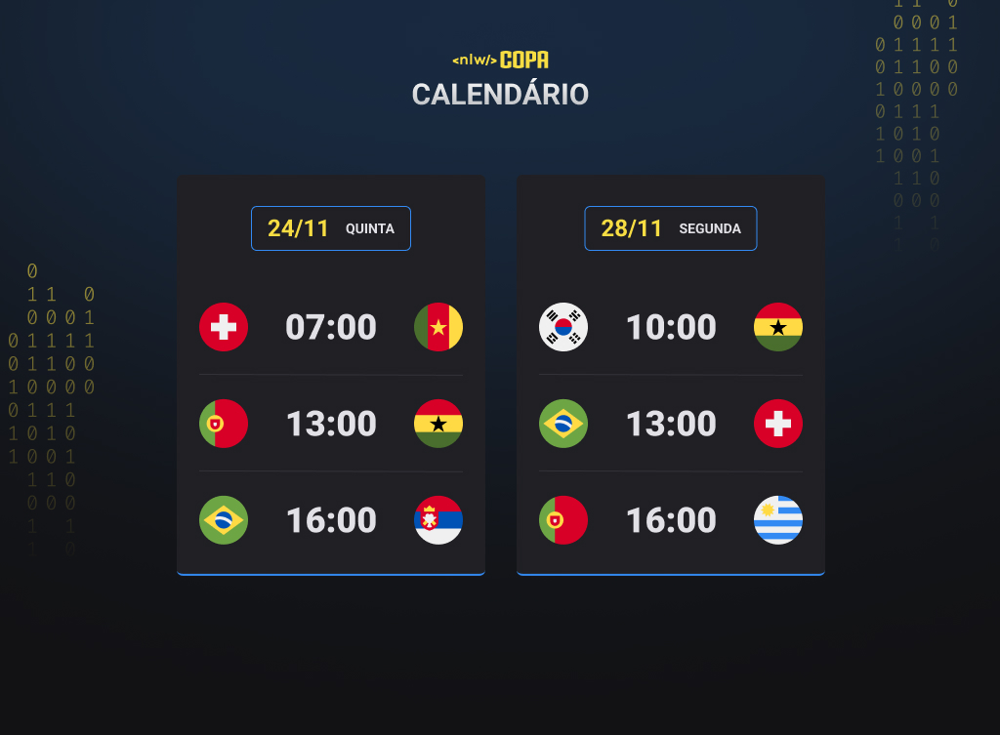

# Explorer Trail NLW Cup

NLW Explorer Trail Cup.
Exclusive and free event, promoted by Rocketeat for teaching WEB technologies.

## 🔨 Project features

This is a World Cup Calendar, a project that shows the matches of the 2022 World Cup in Brazil.

The World Cup is a sporting event of great importance for Brazil for several reasons.

First, Brazil is a nation passionate about football, and the World Cup is the sport's most important competition, bringing together the best teams and players in the world. As such, the event is a great cause for celebration and national pride, with the opportunity for the country to showcase its skills on the field and compete with other nations.

The [Figma of this application you can find here](https://www.figma.com/file/AAZVQKtKd7X703W0m3EYVO/Calend%C3%A1rio-de-Jogos-(Community)?node-id=122%3A130github.com/).

## ✔️ Techniques and technologies used

Check out this list of everything we will use in this app:

- `Responsiveness`
- `JavaScript`
- `HTML 5`
- `CSS 3`
- `Conditional Rendering`
- `AWS Deployment`
- `GitHub`

## 🛠️ Open and run the project

To open and run the project, add the Live Server extension, click on the Go Live button usually located in the lower right corner if you are using vscode.

Then go to <a href="http://127.0.0.1:5500/">http://127.0.0.1:5500/</a> in your browser.

## 📚 More course information

NLW Cup is a track designed to develop frontend skills. The main idea is the most basic task of a frontend, implementing a figma design. The difference is the maximum reuse of logic in the css file to generate game cards.

