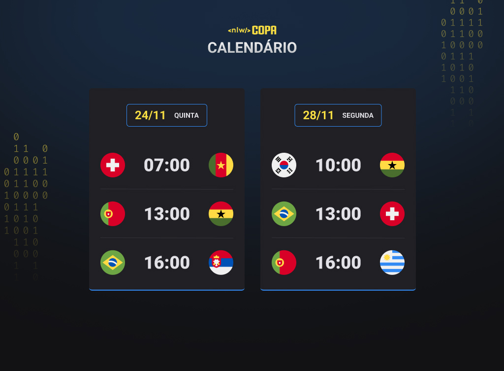

<h1 align="center"> Trilha Explorer NLW Copa </h1>

Evento exlusivo e gratuito, promovido pela Rocketeat para ensino de tecnologias WEB. 

<a href="#tecnologias">Tecnologias</a>&nbsp;&nbsp;&nbsp;&nbsp;|&nbsp;&nbsp;&nbsp;
<a href="#-projeto">Projeto</a>&nbsp;&nbsp;&nbsp;&nbsp;|&nbsp;&nbsp;&nbsp;
<a href="#-layout">Layout</a>&nbsp;&nbsp;&nbsp;&nbsp;|&nbsp;&nbsp;&nbsp;
<a href="#-memo-license">Licença</a>&nbsp;&nbsp;&nbsp;&nbsp;|&nbsp;&nbsp;&nbsp;

</img>

   

</img>

   

## 🧰 Tecnologias

Esse projeto foi desenvolvivo com as seguintes tecnologias:

- HTML e CSS
- JavaScript
- Git e Github
- Responsividade

  

## 📝 Projeto

O calendário da Copa é um projeto que mostra os jogos da chave do Brasil da Copa de 2022.

  

## 🖼️ Layout

Você pode visualizar o layout do projeto através [DESSE LINK](https://www.figma.com/file/AAZVQKtKd7X703W0m3EYVO/Calend%C3%A1rio-de-Jogos-(Community)?node-id=122%3A130github.com/).

  

## 🔗 Link da Página

Você pode acessar a página através [DESSE LINK](https://cristianmeelo.github.io/Trilha-Explorer-NLW-Copa/).
    

Esse projeto está sob a licença MIT.

---

https://www.linkedin.com/in/cristian-melo/

